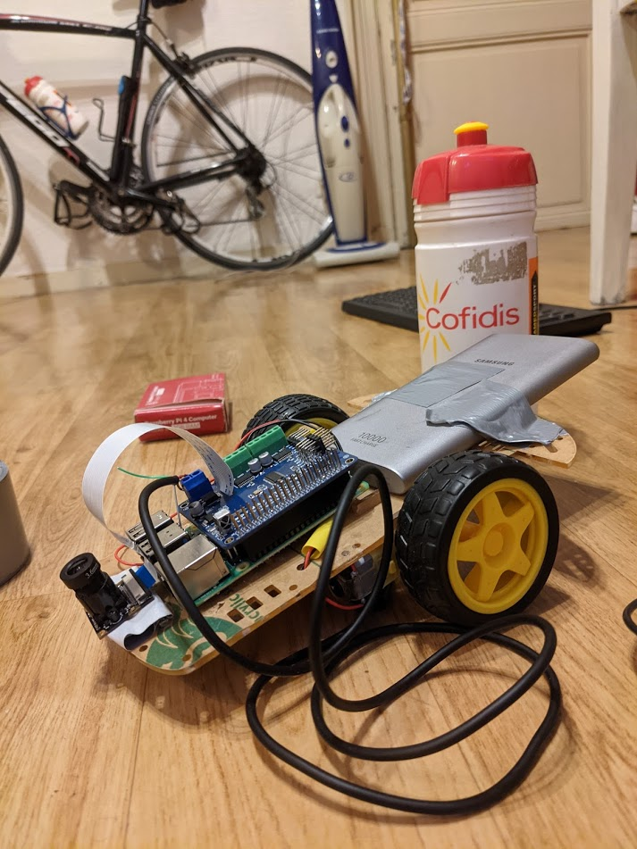

# Tracking Robot

### Goals :
Tracking robot is a robot with 2 wheels with motors which are able to follow red object.
The robot go in the direcion of the reddest object he can see with his camera.

### Hardware :
- 2 motors DC 5V
- Raspberry pi 4B
- NOiR Camera

### Demo :

This project is not sponsored by cofidis ;)
